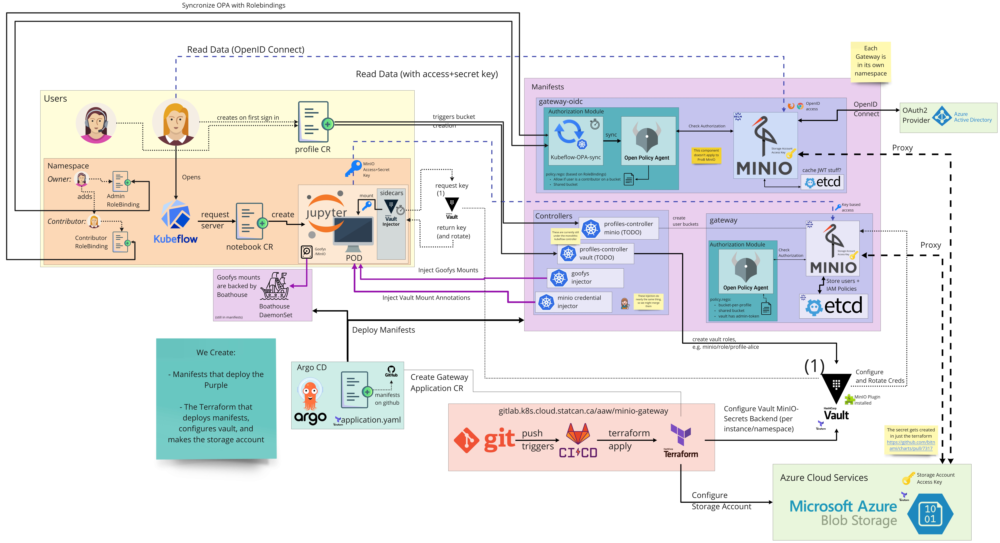

# MinIO Gateway

Each MinIO Gateway consists of MinIO + OPA + Etcd, with MinIO running in gateway mode, `etcd` acting as a cachefor the credentials, and OPA doing the policy enforcement. All except the `OIDC` flavour use `Vault` and the vault-minio-plugin for managing access/secret keys. There are four flavours of the gateway:

**Note: Only the OIDC version will have an Ingress. See notes below**

## overlays/gateway-rw (Read-Write Vault Version)

This version is the stock version, with OPA configuration to allow users to both read and write from MinIO.

**Note: This system will not have an Ingress object.** This will only be accessed by an internal URL, which prevents tokens from being used from outside the cluster.

## overlays/gateway-ro (Read-Only Vault Version)

This version is the stock version, with OPA configuration to only allow READ operations from users.

The typical use-case here is to provide a read-only mirror of the data. For example, unclassified data can be made available as a read-only system to the protected-b notebooks, to allow use-cases like webscraping.


**Note: This system will not have an Ingress object.** This will only be accessed by an internal URL, which prevents tokens from being used from outside the cluster.

## overlays/gateway-oidc (Read-Write OIDC Version)

This version does not use Vault, but instead uses the [`kubeflow-opa-sync`](https://github.com/StatCan/aaw-kubeflow-opa-sync) to get RoleBindings in the namespace. A user can connect to a bucket over OIDC if their username is assigned a contributor role in the namespace.

## overlays/gateway-bundle (Remotely Configured Vault Version)

The `bundle` version refers to [OPA Bundles](https://www.openpolicyagent.org/docs/v0.12.2/bundles/), the use case here is when we are providing access to data within the cluster, but the allowed users and rules around the data is not determined by us. In this case, we are working with the FAIR Data Infrastructure team, who is responsible for the data and governance over it.


# Architecture

Most aspects of the architecture are captured in the diagram below (which pictures a Vault version plus and OIDC version). Note that each MinIO gateway instance resides in a different namespace, mostly to avoid name conflicts as well as to be able to apply network policies at the namespace level.



Notable aspects of the design:

- All instances live in their own namespace.
  + This is to simplify name conflicts and network policies
  + Expected use is to use the `data.statcan.gc.ca/classification` label on the namespace to restrict connections.
  + Only the `minio-gateway:9000` service in the namespace should be reachable by notebooks.
  + Vault needs access to all namespaces (except the OIDC setup). All need to be able to connect to Azure.

- Many systems share one storage account. A single "tenant" could have a `readwrite`, `readonly`, and `oidc` instance, to allow `Unclassified Notebook Access`, `Protected-B Notebook Access`, and `Web-Browser Access`, respectively.

- Only the OIDC Variant gets an ingress. The others are connected to internally only.

- By Design, tokens cannot be used from outside the cluster by users. Outside-of-cluster traffic is only possible through OIDC.

- The Vault versions need the following configurations changes:
  + Instantiate a gateway via the terraform module.
  + Add to the [MinIO Credential injector](https://github.com/StatCan/aaw-argocd-manifests/blob/aaw-dev-cc-00/daaas-system/minio-credential-injector/instances.jsonnet)
  + Add to the [Goofys injector](https://github.com/StatCan/aaw-argocd-manifests/blob/aaw-dev-cc-00/daaas-system/goofys-injector/instances.jsonnet)
  + Add to the [Kubeflow Controller](https://github.com/StatCan/aaw-argocd-manifests/blob/2d827fe546d37fed36bf0974f383b47fe2eff211/daaas-system/kubeflow-controller/deployment.jsonnet#L6-L18) (in the future, the profiles-controller).
  + Grant Vault access by configuring the terraform for Vault which creates the necessary `config`, `mounts` and `roles` for each MinIO instance. At the moment this is done from within the terraform module that deploys these ArgoCD `Application`s. 
  + Configure the Vault roles for `profile-configurator` and `boathouse` to allow them to interact with the MinIO instances. This is in the dedicated `vault` terraform repo.

## Special note on Boathouse

At the moment Boathouse can only connect to external URLs (ingresses) because the CSI driver is not within the cluster and cannot use cluster DNS or kube-proxy.

As a result, the current workaround is to have dedicated `{instance}-boathouse.{domain}` ingresses for boathouse to connect to, and then these ingresses will be restricted to only communicate with the Boathouse service. At the moment the ingress is not locked down, but the proposed solution is to have the ingresses live on a private ingressgateway with a fixed IP, and then configure a firewall to allo communication only to/from that ingressgateway and boathouse.

# Using external addresses within the cluster

Because of the `trafficPolicy: Local` setting on the cluster, commands like `curl https://kubeflow.{domain}` actually fail within the cluster (unless you happen to initiate the request from the same node). This is side-stepped by configuring CoreDNS to bypass this, by routing the requests to the ingress-gateway, which then manages the traffic. 

```yaml
apiVersion: v1
kind: ConfigMap
metadata:
  labels:
    addonmanager.kubernetes.io/mode: EnsureExists
    k8s-app: kube-dns
    kubernetes.io/cluster-service: "true"
  name: coredns-custom
  namespace: kube-system
data:
  ingress.override: |
    rewrite name vault.aaw.cloud.statcan.ca istio-ingressgateway.istio-system.svc.cluster.local
    rewrite name minio-gateway-standard-system-boathouse.aaw.cloud.statcan.ca istio-ingressgateway.istio-system.svc.cluster.local
    rewrite name minio-gateway-premium-system-boathouse.aaw.cloud.statcan.ca istio-ingressgateway.istio-system.svc.cluster.local
    rewrite name minio-gateway-standard-ro-system-boathouse.aaw.cloud.statcan.ca istio-ingressgateway.istio-system.svc.cluster.local
    rewrite name minio-gateway-premium-ro-system-boathouse.aaw.cloud.statcan.ca istio-ingressgateway.istio-system.svc.cluster.local
```
